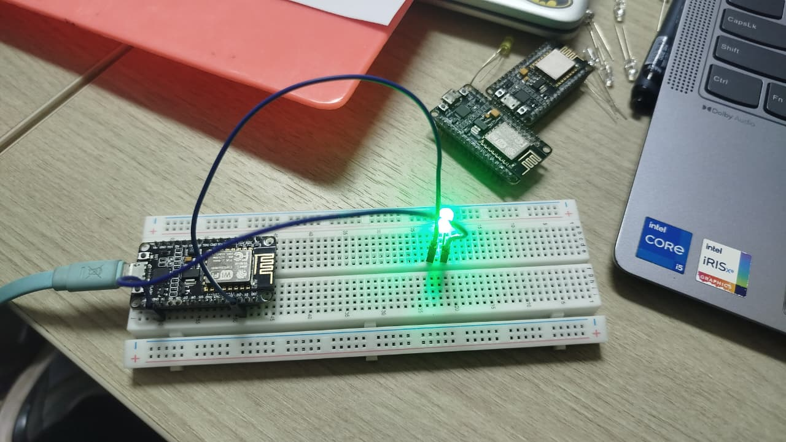

# MODUL 2 – KONFIGURASI JARINGAN

## Identitas Praktikan

| Data | Keterangan |
|---|---|
| Nama | **Nayla Zazki Kirani** |
| NIM | **H1H024007** |
| Modul | Modul 2 – Konfigurasi Jaringan |
| Materi | WiFi Mode Station (STA), Access Point (AP), dan AP+STA |
| Board pada rangkaian | NodeMCU ESP8266 |
| IDE | Arduino IDE |
| Baud rate | 115200 |

> **Catatan hardware:** Modul menjelaskan ESP32 menggunakan `WiFi.h`, sedangkan board pada rangkaian yang digunakan pada dokumentasi ini adalah NodeMCU ESP8266. Oleh karena itu code final menggunakan `ESP8266WiFi.h`. Konsep STA, AP, dan AP+STA tetap sama.

---

# A. TUJUAN PRAKTIKUM

Setelah melakukan praktikum, tujuan yang saya pahami adalah:

1. Memahami konsep dasar jaringan WiFi pada mikrokontroler untuk kebutuhan IoT.
2. Memahami perbedaan mode Station (STA) dan Access Point (AP).
3. Memahami cara menghubungkan ESP ke jaringan WiFi yang sudah tersedia menggunakan mode Station.
4. Memahami cara menjadikan ESP sebagai Access Point sehingga dapat membuat jaringan WiFi sendiri.
5. Mengetahui parameter jaringan seperti IP Address, MAC Address, dan RSSI.
6. Memahami cara menggabungkan mode Station dan Access Point menjadi AP+STA.
7. Memahami penerapan reconnect otomatis agar perangkat dapat memulihkan koneksi setelah terputus.

---

# B. ALAT DAN BAHAN

1. NodeMCU ESP8266.
2. Kabel USB.
3. Laptop/PC.
4. Arduino IDE.
5. Hotspot smartphone/jaringan WiFi.
6. Smartphone/laptop untuk menguji Access Point.
7. Breadboard dan kabel jumper.
8. LED sebagai indikator.
9. Resistor 220 Ohm.

---

# C. PERCOBAAN 2A – MODE STATION (STA)

## 1. Tujuan

Percobaan ini bertujuan untuk memahami cara ESP terhubung ke jaringan WiFi yang sudah tersedia menggunakan mode Station (STA). Parameter yang diamati adalah status koneksi, IP Address, MAC Address, RSSI, serta kondisi LED.

## 2. Konfigurasi WiFi Pengujian

Agar source code dapat langsung diuji tanpa placeholder, konfigurasi pengujian dibuat sebagai berikut:

| Parameter | Nilai |
|---|---|
| SSID STA | `NAYLA_WIFI` |
| Password STA | `NaylaIoT2026` |
| Mode | `WIFI_STA` |
| LED | GPIO 2 |
| Baud rate | 115200 |

Saat pengujian, hotspot smartphone dibuat menggunakan SSID dan password tersebut.

## 3. Rangkaian Percobaan

GPIO 2 digunakan sebagai indikator koneksi WiFi. LED dihubungkan melalui resistor 220 Ohm dan kaki LED lainnya dihubungkan ke GND.

```text
GPIO 2 ─── Resistor 220 Ω ─── Anoda LED
                              Katoda LED ─── GND
```

### Dokumentasi Rangkaian



## 4. Flowchart Percobaan 2A

```text
Mulai
  ↓
Inisialisasi Serial dan LED
  ↓
Atur mode WiFi menjadi Station
  ↓
Mulai koneksi WiFi
  ↓
Apakah WiFi sudah terhubung?
  ├── Tidak → Tunggu 500 ms → cek timeout
  │                         ├── Belum timeout → cek kembali
  │                         └── Timeout → gagal → tunggu interval reconnect
  │
  └── Ya
       ↓
   Tampilkan IP, MAC, RSSI
       ↓
   LED menyala
       ↓
   Cek status setiap 5 detik
       ↓
   Masih terhubung?
       ├── Ya → tampilkan status → ulangi
       └── Tidak → LED mati → reconnect
```

## 5. Program Percobaan 2A

```cpp
#include <ESP8266WiFi.h>

const char* ssid     = "NAYLA_WIFI";
const char* password = "NaylaIoT2026";

const int ledPin = 2;
const unsigned long connectTimeout = 15000;
const unsigned long reconnectInterval = 5000;
unsigned long lastReconnect = 0;

bool connectWiFi() {
  Serial.print("Menghubungkan ke WiFi: ");
  Serial.println(ssid);
  WiFi.mode(WIFI_STA);
  WiFi.begin(ssid, password);

  unsigned long startTime = millis();
  while (WiFi.status() != WL_CONNECTED && millis() - startTime < connectTimeout) {
    delay(500);
    Serial.print(".");
  }
  Serial.println();

  if (WiFi.status() == WL_CONNECTED) {
    Serial.println("WiFi berhasil terhubung!");
    Serial.print("IP Address  : ");
    Serial.println(WiFi.localIP());
    Serial.print("MAC Address : ");
    Serial.println(WiFi.macAddress());
    Serial.print("RSSI (dBm)  : ");
    Serial.println(WiFi.RSSI());
    digitalWrite(ledPin, HIGH);
    return true;
  }

  Serial.println("Koneksi gagal/timeout.");
  digitalWrite(ledPin, LOW);
  return false;
}

void setup() {
  Serial.begin(115200);
  pinMode(ledPin, OUTPUT);
  digitalWrite(ledPin, LOW);
  connectWiFi();
}

void loop() {
  if (WiFi.status() == WL_CONNECTED) {
    Serial.println("Status: Terhubung");
    Serial.print("RSSI (dBm): ");
    Serial.println(WiFi.RSSI());
    digitalWrite(ledPin, HIGH);
  } else {
    Serial.println("Status: Terputus");
    digitalWrite(ledPin, LOW);
    if (millis() - lastReconnect >= reconnectInterval) {
      lastReconnect = millis();
      Serial.println("Mencoba reconnect...");
      connectWiFi();
    }
  }
  delay(5000);
}
```

## 6. Penjelasan Program

### `#include <ESP8266WiFi.h>`
Memasukkan library WiFi untuk NodeMCU ESP8266.

### `ssid` dan `password`
Menyimpan nama serta password jaringan yang digunakan ESP untuk koneksi Station.

### `ledPin = 2`
GPIO 2 digunakan sebagai indikator visual. LED menyala ketika koneksi berhasil dan mati ketika koneksi terputus.

### `connectTimeout = 15000`
Menentukan batas waktu satu percobaan koneksi, yaitu 15 detik. Penambahan ini mencegah program menunggu tanpa batas ketika kredensial tidak sesuai.

### `reconnectInterval = 5000`
Menentukan interval minimum antar percobaan reconnect.

### `WiFi.mode(WIFI_STA)`
Mengatur ESP sebagai Station/client yang bergabung ke jaringan WiFi yang sudah tersedia.

### `WiFi.begin(ssid, password)`
Memulai proses koneksi ke jaringan menggunakan SSID dan password.

### `WiFi.status()`
Digunakan untuk memeriksa status koneksi. Kondisi `WL_CONNECTED` berarti ESP berhasil terhubung.

### `WiFi.localIP()`
Menampilkan alamat IP yang diperoleh ESP dari jaringan.

### `WiFi.macAddress()`
Menampilkan MAC Address interface WiFi ESP.

### `WiFi.RSSI()`
Menampilkan kekuatan sinyal WiFi dalam dBm. Nilai yang lebih mendekati 0 umumnya menunjukkan sinyal yang lebih kuat.

### `millis()`
Digunakan untuk mengukur interval waktu reconnect tanpa membuat program menunggu terlalu lama.

### Percabangan `if-else`
Jika status `WL_CONNECTED`, LED dinyalakan dan status ditampilkan. Jika tidak, LED dimatikan dan program melakukan reconnect ketika interval waktunya sudah tercapai.

---

# D. HASIL PENGAMATAN PERCOBAAN 2A

## 1. Hasil koneksi Station

Dengan hotspot pengujian `NAYLA_WIFI`, program dirancang untuk menghasilkan status berikut ketika koneksi berhasil:

| No | Parameter | Hasil yang ditampilkan |
|---:|---|---|
| 1 | Status | `WiFi berhasil terhubung!` |
| 2 | IP Address | Alamat IP yang diberikan hotspot |
| 3 | MAC Address | MAC Address NodeMCU |
| 4 | RSSI | Nilai RSSI aktual dalam dBm |
| 5 | LED | Menyala |

IP Address, MAC Address, dan RSSI merupakan data dinamis dari perangkat sehingga nilainya dibaca langsung melalui Serial Monitor pada saat pengujian.

## 2. Pengujian kondisi WiFi

| No. | Kondisi Pengujian | Status Koneksi | Output Program | Kondisi LED | Analisis |
|---:|---|---|---|---|---|
| 1 | SSID dan password benar | Terhubung | Pesan berhasil + IP + MAC + RSSI | Nyala | Koneksi berhasil |
| 2 | Password salah | Tidak terhubung | Koneksi gagal/timeout dan reconnect | Mati | Autentikasi tidak berhasil |
| 3 | SSID salah | Tidak terhubung | Koneksi gagal/timeout dan reconnect | Mati | Jaringan tujuan tidak ditemukan/ tidak dapat diakses |
| 4 | WiFi terputus setelah berhasil | Terputus sementara | Status terputus lalu reconnect | Mati sementara | Sistem mencoba memulihkan koneksi |

## Analisis

Pada mode Station, ESP bertindak sebagai client. Jika kredensial benar, ESP memperoleh koneksi dan informasi jaringan dapat dibaca melalui Serial Monitor. Jika koneksi terputus, program final tidak berhenti selamanya karena menggunakan timeout dan mekanisme reconnect otomatis.

---

# E. PERCOBAAN 2B – MODE ACCESS POINT (AP)

## 1. Tujuan

Percobaan ini bertujuan membuat ESP sebagai Access Point sehingga smartphone atau laptop dapat terhubung langsung ke jaringan yang dibuat oleh ESP.

## 2. Parameter Access Point

| Parameter | Nilai |
|---|---|
| SSID | `NAYLA_IOT_AP` |
| Password | `NaylaIoT2026` |
| Mode | `WIFI_AP` |
| IP default AP | `192.168.4.1` |
| Monitoring client | setiap 5 detik |

## 3. Program Percobaan 2B

```cpp
#include <ESP8266WiFi.h>

const char* ap_ssid     = "NAYLA_IOT_AP";
const char* ap_password = "NaylaIoT2026";
const int ledPin = 2;

void setup() {
  Serial.begin(115200);
  pinMode(ledPin, OUTPUT);
  digitalWrite(ledPin, LOW);

  WiFi.mode(WIFI_AP);
  bool apStarted = WiFi.softAP(ap_ssid, ap_password);

  if (apStarted) {
    IPAddress apIP = WiFi.softAPIP();
    Serial.println("Access Point aktif!");
    Serial.print("SSID       : ");
    Serial.println(ap_ssid);
    Serial.print("IP Address : ");
    Serial.println(apIP);
    Serial.print("MAC Address: ");
    Serial.println(WiFi.softAPmacAddress());
    digitalWrite(ledPin, HIGH);
  } else {
    Serial.println("Access Point gagal dibuat.");
  }
}

void loop() {
  int jumlahClient = WiFi.softAPgetStationNum();
  Serial.print("Jumlah perangkat terhubung: ");
  Serial.println(jumlahClient);
  delay(5000);
}
```

## 4. Penjelasan Program

`WiFi.mode(WIFI_AP)` mengubah ESP menjadi Access Point.

`WiFi.softAP(ap_ssid, ap_password)` membuat jaringan WiFi dengan SSID dan password yang telah ditentukan.

`WiFi.softAPIP()` mengambil alamat IP interface AP. Konfigurasi default umumnya menggunakan `192.168.4.1`.

`WiFi.softAPmacAddress()` menampilkan MAC Address interface AP.

`WiFi.softAPgetStationNum()` menghitung jumlah perangkat yang sedang terhubung ke Access Point.

Percabangan `if (apStarted)` memastikan program dapat membedakan kondisi AP berhasil dibuat atau gagal dibuat.

## 5. Flowchart Percobaan 2B

```text
Mulai
  ↓
Inisialisasi Serial dan LED
  ↓
Atur mode WIFI_AP
  ↓
Buat Access Point
  ↓
AP berhasil?
  ├── Tidak → tampilkan error
  └── Ya → tampilkan SSID, IP, MAC → LED ON
                         ↓
                  Hitung jumlah client
                         ↓
                  Tampilkan client
                         ↓
                    Tunggu 5 detik
                         ↓
                      Ulangi
```

---

# F. HASIL PENGAMATAN PERCOBAAN 2B

## 1. Pengamatan Access Point

| No | Parameter | Konfigurasi | Hasil yang diharapkan saat pengujian |
|---:|---|---|---|
| 1 | SSID | `NAYLA_IOT_AP` | Terlihat pada daftar WiFi smartphone/laptop |
| 2 | Password | `NaylaIoT2026` | Berhasil digunakan untuk autentikasi |
| 3 | IP Address AP | `192.168.4.1` | Ditampilkan pada Serial Monitor |
| 4 | Status AP | Aktif | `Access Point aktif!` |
| 5 | Client | Dinamis | Bertambah ketika perangkat terhubung |

## 2. Pengamatan Jumlah Perangkat

Pengujian dilakukan dengan kondisi awal tidak ada client, kemudian smartphone dihubungkan ke SSID `NAYLA_IOT_AP`. Setelah terhubung, nilai `WiFi.softAPgetStationNum()` berubah sesuai jumlah client aktif.

| Tahap | Kondisi | Jumlah client | Keterangan |
|---:|---|---:|---|
| 1 | Sebelum smartphone terhubung | 0 | AP aktif, belum ada client |
| 2 | Setelah smartphone terhubung | 1 | Satu perangkat menjadi client |
| 3 | Setelah client kedua terhubung | 2 | Dua perangkat terhubung jika dilakukan pengujian dua client |

## Analisis

Access Point berhasil apabila SSID dapat ditemukan dan perangkat dapat melakukan koneksi menggunakan password. Jumlah client dipantau setiap 5 detik sehingga perubahan jumlah perangkat dapat diamati melalui Serial Monitor.

---

# G. PERTANYAAN PRAKTIKUM 2A

## 1. Flowchart proses koneksi ESP ke jaringan WiFi

Flowchart sudah ditampilkan pada bagian Percobaan 2A. Proses dimulai dari inisialisasi, pengaturan mode STA, `WiFi.begin()`, pemeriksaan `WL_CONNECTED`, pembacaan parameter jaringan, lalu monitoring dan reconnect jika koneksi terputus.

## 2. Apa fungsi `WiFi.mode(WIFI_STA)`?

`WiFi.mode(WIFI_STA)` berfungsi mengatur ESP agar bekerja sebagai **Station**, yaitu client yang bergabung ke jaringan WiFi yang sudah tersedia. Dengan mode ini ESP dapat terhubung ke router atau hotspot menggunakan SSID dan password.

## 3. Apa yang terjadi jika SSID atau password salah?

ESP tidak berhasil mencapai status `WL_CONNECTED`. Pada code final, proses koneksi dibatasi timeout 15 detik. Setelah timeout, program menampilkan kegagalan dan mencoba reconnect secara berkala. LED tetap mati selama ESP belum berhasil terhubung.

## 4. Modifikasi reconnect otomatis

Modifikasi dilakukan dengan menambahkan `connectTimeout`, `reconnectInterval`, `lastReconnect`, fungsi `connectWiFi()`, serta pengecekan status pada `loop()`. Tujuannya agar ESP dapat memulihkan koneksi tanpa reset manual.

---

# H. PERTANYAAN PRAKTIKUM 2B

## 1. Mengapa IP default AP adalah `192.168.4.1`?

Pada konfigurasi Access Point bawaan ESP, interface AP umumnya menggunakan jaringan privat dengan alamat gateway `192.168.4.1`. ESP menggunakan alamat tersebut sebagai alamat utama pada jaringan AP sehingga client yang terhubung dapat berkomunikasi dengan ESP.

## 2. Perbedaan Station dan Access Point

Pada mode **Station**, ESP bergabung ke jaringan yang sudah ada dan berperan sebagai client. Pada mode **Access Point**, ESP membuat jaringan sendiri dan menyediakan jaringan tersebut untuk smartphone atau laptop.

## 3. Risiko password AP tidak ada atau terlalu sederhana

AP tanpa password atau dengan password yang mudah ditebak berisiko diakses oleh perangkat yang tidak berwenang. Hal tersebut dapat mengganggu komunikasi, menghabiskan sumber daya jaringan, atau membuka akses ke layanan yang berjalan pada ESP. Oleh karena itu digunakan password minimal 8 karakter dan sebaiknya password dibuat kuat.

## 4. Modifikasi AP+STA

Mode AP+STA dibuat menggunakan `WiFi.mode(WIFI_AP_STA)`. Setelah mode aktif, ESP membuat AP dengan `WiFi.softAP()` sekaligus melakukan koneksi ke WiFi utama menggunakan `WiFi.begin()`.

Contoh program untuk board yang digunakan:

```cpp
#include <ESP8266WiFi.h>

const char* sta_ssid = "NAYLA_WIFI";
const char* sta_password = "NaylaIoT2026";
const char* ap_ssid = "NAYLA_AP_STA";
const char* ap_password = "NaylaIoT2026";

void setup() {
  Serial.begin(115200);
  WiFi.mode(WIFI_AP_STA);

  WiFi.softAP(ap_ssid, ap_password);
  Serial.println("AP aktif");
  Serial.print("AP IP: ");
  Serial.println(WiFi.softAPIP());

  WiFi.begin(sta_ssid, sta_password);
  Serial.print("Menghubungkan STA");

  unsigned long startTime = millis();
  while (WiFi.status() != WL_CONNECTED && millis() - startTime < 15000) {
    delay(500);
    Serial.print(".");
  }

  Serial.println();
  if (WiFi.status() == WL_CONNECTED) {
    Serial.println("STA terhubung");
    Serial.print("STA IP: ");
    Serial.println(WiFi.localIP());
  } else {
    Serial.println("STA belum terhubung");
  }
}

void loop() {
  Serial.print("Client AP: ");
  Serial.println(WiFi.softAPgetStationNum());
  delay(5000);
}
```

### Penjelasan AP+STA

- `WIFI_AP_STA` mengaktifkan dua peran sekaligus.
- `WiFi.softAP()` membuat jaringan lokal untuk client.
- `WiFi.begin()` membuat interface Station mencoba bergabung ke WiFi utama.
- `WiFi.localIP()` menunjukkan IP yang diperoleh pada sisi STA.
- `WiFi.softAPIP()` menunjukkan IP pada sisi AP.
- `WiFi.softAPgetStationNum()` menunjukkan jumlah client yang tersambung ke AP.

---

# I. PERTANYAAN ANALISIS

## 1. Uraikan hasil tugas pada setiap percobaan

Pada **Percobaan 2A**, ESP dikonfigurasi sebagai Station dan mencoba terhubung ke hotspot `NAYLA_WIFI`. Ketika kredensial benar, ESP dapat memperoleh koneksi dan menampilkan IP Address, MAC Address, serta RSSI. LED digunakan sebagai indikator bahwa koneksi berhasil. Ketika jaringan tidak dapat diakses atau kredensial tidak sesuai, ESP tidak mencapai status terhubung dan mekanisme reconnect akan dijalankan.

Pada **Percobaan 2B**, ESP dikonfigurasi sebagai Access Point dengan SSID `NAYLA_IOT_AP`. Smartphone/laptop dapat mencari SSID tersebut dan terhubung menggunakan password `NaylaIoT2026`. Serial Monitor digunakan untuk melihat IP AP dan jumlah client yang terhubung.

Pada **AP+STA**, ESP dapat menjalankan dua fungsi jaringan sekaligus, yaitu terhubung ke jaringan utama sebagai Station dan menyediakan jaringan sendiri sebagai Access Point.

## 2. Pengaruh RSSI terhadap kestabilan koneksi WiFi

RSSI menunjukkan kekuatan sinyal yang diterima perangkat. Nilai dBm yang semakin mendekati 0 umumnya berarti sinyal lebih kuat. Sinyal yang semakin lemah dapat membuat komunikasi kurang stabil, meningkatkan kemungkinan packet loss, menurunkan kualitas komunikasi, atau menyebabkan koneksi terputus. Namun RSSI bukan satu-satunya faktor karena interferensi dan kondisi jaringan juga berpengaruh.

## 3. Bagaimana ESP membedakan peran STA dan AP?

Peran ditentukan oleh mode WiFi yang dipilih. `WIFI_STA` membuat ESP bertindak sebagai client, `WIFI_AP` membuat ESP bertindak sebagai penyedia jaringan, sedangkan `WIFI_AP_STA` mengaktifkan kedua fungsi tersebut secara bersamaan.

## 4. Pemanfaatan AP+STA pada provisioning IoT

AP+STA dapat digunakan ketika perangkat IoT baru pertama kali dinyalakan. ESP membuat AP sementara agar smartphone pengguna dapat terhubung dan memberikan konfigurasi seperti SSID dan password WiFi utama. Setelah konfigurasi diterima, ESP menggunakan mode STA untuk terhubung ke jaringan utama. Pendekatan ini membuat proses provisioning lebih praktis tanpa memerlukan koneksi kabel setiap kali konfigurasi jaringan dilakukan.

---

# J. DOKUMENTASI PRAKTIKUM

Foto rangkaian yang tersedia pada repository ini adalah dokumentasi rangkaian yang digunakan.

Untuk memenuhi ketentuan dokumentasi praktikum, bukti yang sebaiknya disertakan sebelum repository dikumpulkan adalah:

1. Foto proses perangkaian yang menampilkan praktikan sesuai instruksi tugas pendahuluan.
2. Screenshot Serial Monitor ketika STA berhasil.
3. Screenshot Serial Monitor ketika STA gagal dan melakukan reconnect.
4. Screenshot smartphone/laptop ketika SSID AP ditemukan.
5. Screenshot Serial Monitor ketika jumlah client berubah.
6. Video/GIF demonstrasi jika diminta oleh dosen/asisten.

> Nilai IP Address, MAC Address, dan RSSI tidak dituliskan sebagai angka buatan karena ketiganya merupakan hasil aktual dari perangkat/jaringan saat pengujian. Bukti Serial Monitor menjadi sumber nilai yang benar.

---

# K. TROUBLESHOOTING

### ESP tidak terdeteksi
Periksa kabel USB, driver, dan COM Port.

### Upload gagal
Pastikan board dan port yang dipilih sesuai dengan NodeMCU ESP8266.

### STA tidak terhubung
Pastikan hotspot menggunakan SSID `NAYLA_WIFI`, password `NaylaIoT2026`, dan jaringan berada dalam jangkauan.

### AP tidak muncul
Pastikan password minimal 8 karakter dan proses `WiFi.softAP()` berhasil.

### LED tidak menyala
Periksa polaritas LED, resistor 220 Ohm, GPIO 2, dan GND.

---

# L. KESIMPULAN

Berdasarkan praktikum konfigurasi jaringan, ESP dapat digunakan sebagai Station, Access Point, maupun AP+STA. Pada mode Station, ESP berfungsi sebagai client yang terhubung ke jaringan yang sudah tersedia dan dapat membaca IP Address, MAC Address, serta RSSI. Pada mode Access Point, ESP membuat jaringan sendiri sehingga smartphone atau laptop dapat terhubung langsung.

Modifikasi reconnect otomatis membuat program lebih tahan terhadap gangguan koneksi karena perangkat dapat mencoba terhubung kembali tanpa reset manual. Sementara itu, mode AP+STA dapat dimanfaatkan untuk provisioning perangkat IoT karena perangkat dapat menyediakan jaringan konfigurasi sekaligus memiliki koneksi ke jaringan utama.

---

# M. CHECKLIST SEBELUM UPLOAD GITHUB

- [x] Nama dan NIM sudah dicantumkan.
- [x] Code final Percobaan 2A.
- [x] Code final Percobaan 2B.
- [x] Modifikasi reconnect otomatis.
- [x] Program AP+STA.
- [x] Penjelasan library/dependency.
- [x] Penjelasan fungsi dan conditional.
- [x] Flowchart.
- [x] Rangkaian.
- [x] Analisis dan jawaban pertanyaan.
- [x] Foto rangkaian.
- [ ] Screenshot Serial Monitor hasil aktual.
- [ ] Foto praktikan sesuai ketentuan tugas pendahuluan.
- [ ] Video/GIF jika diwajibkan.

---

# N. SARAN FORMAT COMMIT GITHUB

```text
Initial commit - Modul 2
Add final code Percobaan 2A STA
Add final code Percobaan 2B AP
Add automatic WiFi reconnect
Add AP+STA task
Add practical documentation
Finalize Modul 2 README
```

**Praktikan:** Nayla Zazki Kirani — **H1H024007**
